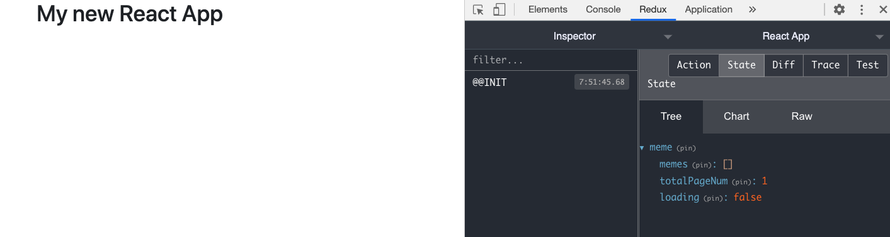

## Redux configuration

### Redux store configuration

- Create `src/redux/store.js`:
  ```javascript
  import { createStore, applyMiddleware } from "redux";
  import { composeWithDevTools } from "redux-devtools-extension";
  import thunk from "redux-thunk";
  import rootReducer from "redux/reducers";

  const initialState = {};
  const store = createStore(
    rootReducer,
    initialState,
    composeWithDevTools(applyMiddleware(thunk))
  );

  export default store;
  ```

- In `src/index.js`:
  ```javascript
  import { Provider } from "react-redux";
  import store from "redux/store";
  ...
  ReactDOM.render(
    <Provider store={store}>
      <App />
    </Provider>,
    document.getElementById("root")
  )
  ```

### The API Service

[axios](https://github.com/axios/axios#request-config) has become undeniably popular among frontend developers. Axios is a promise based HTTP client for the browser and Node.js. Axios makes it easy to send asynchronous HTTP requests to REST endpoints.

We put the axios configuration in `src/redux/api.js`. This config will print out every Request and Response. It also passes the error message to `react-toastify` automatically.

So all of the connections to the backend API will go through this API service. Think about it like a city gate. 

- Create `src/redux/api.js`

```javascript
import axios from "axios";
import { toast } from "react-toastify";

const api = axios.create({
  baseURL: process.env.REACT_APP_BACKEND_API + "/api",
  headers: {
    "Content-Type": "application/json",
  },
});
/**
 * console.log all requests and responses
 */
api.interceptors.request.use(
  (request) => {
    console.log("Starting Request", request);
    return request;
  },
  function (error) {
    console.log("REQUEST ERROR", error);
  }
);

api.interceptors.response.use(
  (response) => {
    console.log("Response:", response);
    return response;
  },
  function (error) {
    error = error.response.data;
    console.log("RESPONSE ERROR", error);
    if (error.errors && error.errors.message)
      toast.error(error.errors.message);
    return Promise.reject(error);
  }
);

export default api;
```

### Prepare the constants, actions and reducers

In this app we will have only one store for meme.

- In `src/redux/constants/`, create `meme.constants.js`
  ```javascript
  export const GET_MEMES_REQUEST = "MEME.GET_MEMES_REQUEST";
  export const GET_MEMES_SUCCESS = "MEME.GET_MEMES_SUCCESS";
  export const GET_MEMES_FAILURE = "MEME.GET_MEMES_FAILURE";
  ```

- In `src/redux/actions/`, create `meme.actions.js`
  ```javascript
  import * as types from "redux/constants/meme.constants";
  import api from "redux/api";

  const memesRequest = (pageNum) => async (dispatch) => {
    dispatch({ type: types.GET_MEMES_REQUEST, payload: null });
    try {
      const res = await api.get(`/memes?page=${pageNum}&perPage=9`);
      dispatch({ type: types.GET_MEMES_SUCCESS, payload: res.data.data });
    } catch (error) {
      dispatch({ type: types.GET_MEMES_FAILURE, payload: error });
    }
  };

  export const memeActions = {
    memesRequest,
  };
  ```

- In `redux/actions/index.js`:
  ```javascript
  export * from "./meme.actions";
  ```

- In `src/redux/reducers/`, create `meme.reducer.js`
  ```javascript
  import * as types from "redux/constants/meme.constants";

  const initialState = {
    memes: [],
    totalPageNum: 1,
    loading: false,
  };

  const memeReducer = (state = initialState, action) => {
    const { type, payload } = action;
    switch (type) {
      case types.GET_MEMES_REQUEST:
        return { ...state, loading: true };
      case types.GET_MEMES_SUCCESS:
        return {
          ...state,
          memes: payload.memes,
          totalPageNum: payload.totalPages,
          loading: false,
        };
      case types.GET_MEMES_FAILURE:
        console.log(payload);
        return { ...state, loading: false };
      default:
        return state;
    }
  };

  export default memeReducer;
  ```

- In `redux/reducer/index.js`:
  ```javascript
  import { combineReducers } from "redux";
  import memeReducer from "./meme.reducer";

  export default combineReducers({
    meme: memeReducer,
  });
  ```

### Evaluation

- Now let's install [Redux DevTools](https://chrome.google.com/webstore/detail/redux-devtools/lmhkpmbekcpmknklioeibfkpmmfibljd?hl=en). This is an awesome tool for debugging application's state changes.

- Open Chrome DevTools, click on the tab `Redux`, you should see:

  

Good job! [Back to instructions](/README.md)