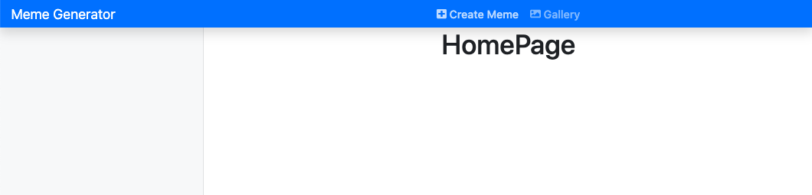
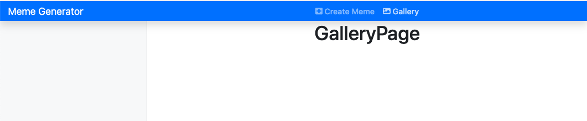
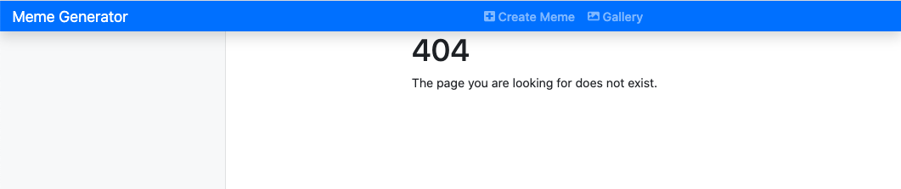

## React Router and layouts

In this step, we'll setup the routes to the pages in our React app, e.g. Home Page, Gallery Page, etc. 

### The dumb components

We start with "stateless" components first:

- Create `src/components/AlertMsg.js`:
  ```javascript
  import React from "react";
  import { ToastContainer } from "react-toastify";
  import "react-toastify/dist/ReactToastify.min.css";

  const AlertMsg = () => {
    return (
      <ToastContainer
        position="top-right"
        hideProgressBar={false}
        newestOnTop={false}
        pauseOnHover
      />
    );
  };

  export default AlertMsg;
  ```

- Create `src/components/NotFoundPage.js`:
  ```javascript
  import React from "react";
  import { Container, Row, Col } from "react-bootstrap";

  const NotFoundPage = () => {
    return (
      <Container>
        <Row>
          <Col md={{ span: 6, offset: 3 }}>
            <h1>404</h1>
            <p>The page you are looking for does not exist.</p>
          </Col>
        </Row>
      </Container>
    );
  };
  export default NotFoundPage;
  ```

- Create `src/components/NavbarHeader.js`:
  ```javascript
  import React from "react";
  import { Nav, Navbar } from "react-bootstrap";
  import { Link } from "react-router-dom";
  import { FontAwesomeIcon } from "@fortawesome/react-fontawesome";

  const NavbarHeader = () => {
    return (
      <Navbar
        bg="primary"
        variant="dark"
        expand="md"
        className="sticky-top p-0 shadow"
      >
        <Navbar.Brand as={Link} className="col-md-3 mr-0 px-3" to="/">
          Meme Generator
        </Navbar.Brand>
        <Navbar.Toggle aria-controls="basic-navbar-nav" />
        <Navbar.Collapse id="basic-navbar-nav">
          <Nav className="m-auto">
            <Nav.Link as={Link} to="/">
              <FontAwesomeIcon icon="plus-square" /> Create Meme
            </Nav.Link>
            <Nav.Link as={Link} to="/gallery">
              <FontAwesomeIcon icon="image" /> Gallery
            </Nav.Link>
          </Nav>
        </Navbar.Collapse>
      </Navbar>
    );
  };

  export default NavbarHeader;
  ```

### Create pages and side menu

- In `src/containers/`, create `HomePage.js`, `GalleryPage.js`. In each file, use `rface` to create the component and add a `h1` title according to the page. Example, in `src/containers/HomePage.js`:

  ```javascript
  import React from "react";

  const HomePage = () => {
    return (
      <div>
        <h1>HomePage</h1>
      </div>
    );
  };

  export default HomePage;
  ```

- Create `src/containers/SideMenu.js`:
  ```javascript
  import React from "react";
  import { Nav } from "react-bootstrap";

  const SideMenu = () => {
    return (
      <Nav className="col-md-3 d-md-block bg-light sidebar collapse">
        <div className="sidebar-sticky pt-3"></div>
      </Nav>
    );
  };

  export default SideMenu;
  ```

- Create `src/containers/Routes/index.js`: `rface` then add `Switch` and `Route` from `react-router-dom`:
  ```javascript
  import React from "react";
  import { Switch, Route } from "react-router-dom";
  import { Container, Row, Col } from "react-bootstrap";
  import NavbarHeader from "components/NavbarHeader";
  import SideMenu from "containers/SideMenu";
  import AlertMsg from "components/AlertMsg";
  import HomePage from "containers/HomePage";
  import GalleryPage from "containers/GalleryPage";
  import NotFoundPage from "components/NotFoundPage";

  const Routes = () => {
    return (
      <>
        <NavbarHeader />
        <Container fluid>
          <Row>
            <SideMenu />
            <Col md={9} className="d-flex justify-content-center">
              <AlertMsg />
              <Switch>
                <Route exact path="/" component={HomePage} />
                <Route exact path="/gallery" component={GalleryPage} />
                <Route component={NotFoundPage} />
              </Switch>
            </Col>
          </Row>
        </Container>
      </>
    );
  };

  export default Routes;
  ```

- In `App.js`:
  ```javascript
  import React from "react";
  import "./App.css";
  import "bootstrap/dist/css/bootstrap.min.css";
  import { BrowserRouter as Router } from "react-router-dom";
  import Routes from "./containers/Routes";
  import { library } from "@fortawesome/fontawesome-svg-core";
  import { faImage, faPlusSquare } from "@fortawesome/free-solid-svg-icons";

  library.add(faImage, faPlusSquare);

  function App() {
    return (
      <Router>
        <Routes />
      </Router>
    );
  }

  export default App;
  ```

- In `App.css`:
  ```css
  /*
  * Sidebar
  */

  .sidebar {
    top: 0;
    bottom: 0;
    left: 0;
    z-index: 100; /* Behind the navbar */
    min-height: 100vh !important;
    padding: 0;
    box-shadow: inset -1px 0 0 rgba(0, 0, 0, .1);
  }

  @media (max-width: 767.98px) {
    .sidebar {
      top: 5rem;
    }
  }

  .sidebar-sticky {
    top: 0;
    height: calc(100vh - 48px);
    padding-top: .5rem;
    overflow-x: hidden;
    overflow-y: auto; /* Scrollable contents if viewport is shorter than content. */
  }

  @supports ((position: -webkit-sticky) or (position: sticky)) {
    .sidebar-sticky {
      position: -webkit-sticky;
      position: sticky;
    }
  }

  .nav-link {
    font-weight: 500;
    color: #333;
  }

  .nav-link.active {
    color: #007bff !important;
  }
  ```

### Evaluation

- Open your browser `localhost:3000`:
  

- Click on `Gallery` and `Create Meme` should lead you to the Gallery page and Home page:
  


- Try to go to `localhost:3000/not_found`:
  

Good job! [Back to instructions](/client.md)
