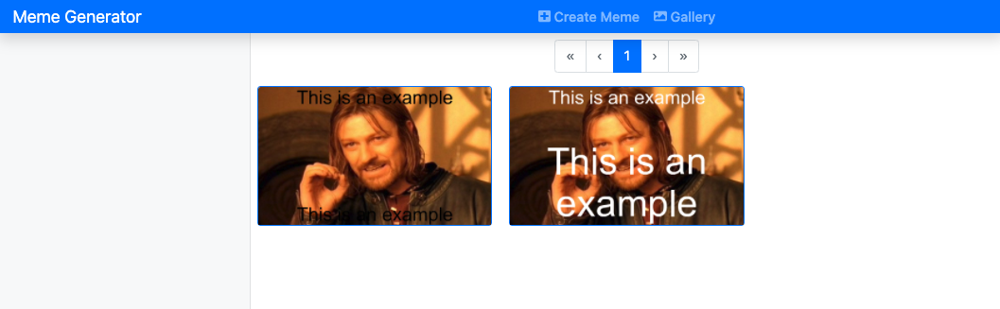
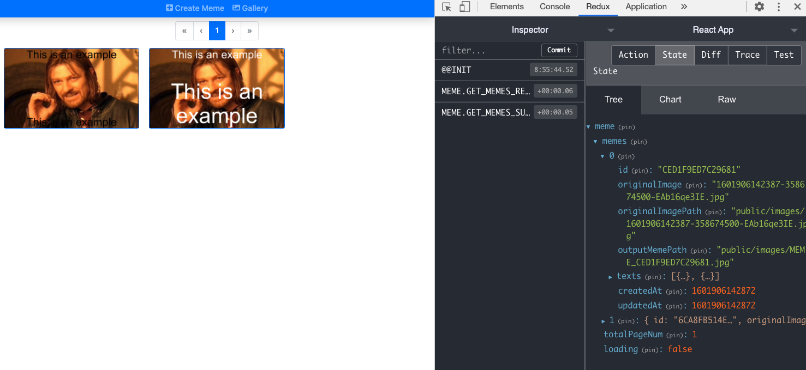

## User can see the list of memes in gallery page with pagination

- Create `src/components/PaginationBar.js`:
  ```javascript
  import React from "react";
  import { Pagination } from "react-bootstrap";

  const PaginationBar = ({ pageNum, setPageNum, totalPageNum, loading }) => {
    const handleClick = (page) => {
      if (!loading) {
        setPageNum(parseInt(page));
      }
    };

    const handleClickOnFirst = () => {
      if (!loading) {
        setPageNum(1);
      }
    };

    const handleClickOnLast = () => {
      if (!loading) {
        setPageNum(totalPageNum);
      }
    };
    const handleClickOnNext = () => {
      if (pageNum < totalPageNum && !loading) {
        setPageNum((num) => num + 1);
      }
    };
    const handleClickOnPrev = () => {
      if (pageNum > 1 && !loading) {
        setPageNum((num) => num - 1);
      }
    };

    return (
      <Pagination className="justify-content-center" disabled={loading}>
        <Pagination.First disabled={pageNum === 1} onClick={handleClickOnFirst} />
        <Pagination.Prev disabled={pageNum === 1} onClick={handleClickOnPrev} />
        <Pagination.Item active={pageNum === 1} onClick={() => handleClick(1)}>
          {1}
        </Pagination.Item>

        {pageNum - 1 > 1 && <Pagination.Ellipsis />}
        {pageNum > 1 && pageNum < totalPageNum && (
          <Pagination.Item active>{pageNum}</Pagination.Item>
        )}
        {totalPageNum > pageNum + 1 && <Pagination.Ellipsis />}

        {totalPageNum > 1 && (
          <Pagination.Item
            active={pageNum === totalPageNum}
            onClick={() => handleClick(totalPageNum)}
          >
            {totalPageNum}
          </Pagination.Item>
        )}

        <Pagination.Next
          disabled={pageNum === totalPageNum}
          onClick={handleClickOnNext}
        />
        <Pagination.Last
          disabled={pageNum === totalPageNum}
          onClick={handleClickOnLast}
        />
      </Pagination>
    );
  };

  export default PaginationBar;
  ```

- Create `src/components/MemeList.js`:
  ```javascript
  import React from "react";
  import { Card, CardColumns } from "react-bootstrap";

  const MemeList = ({ memes, showDetail }) => {
    return (
      <>
        {memes?.length > 0 ? (
          <CardColumns>
            <ul className="list-unstyled">
              {memes.map((meme) => (
                <MemeCard meme={meme} showDetail={showDetail} key={meme.id} />
              ))}
            </ul>
          </CardColumns>
        ) : (
          <p className="text-center">There are no memes</p>
        )}
      </>
    );
  };

  const MemeCard = ({ meme, showDetail }) => {
    return (
      <Card
      border="primary"
      className="mouse-hover"
      onClick={() => showDetail(meme)}
      >
        <Card.Img
          variant="top"
          src={`${process.env.REACT_APP_BACKEND_API}/${
          meme.outputMemePath.split("public/")[1]
        }?${meme.updatedAt}`}
        />
      </Card>
    );
  };

  export default MemeList;
  ```

- In `GalleryPage.js`:
  ```javascript
  import MemeList from "components/MemeList";
  import PaginationBar from "components/PaginationBar";
  import React, { useState, useEffect } from "react";
  import { Container, Row } from "react-bootstrap";
  import { useSelector, useDispatch } from "react-redux";
  import { ClipLoader } from "react-spinners";
  import { memeActions } from "redux/actions";

  const GalleryPage = () => {
    const [pageNum, setPageNum] = useState(1);
    const dispatch = useDispatch();
    const loading = useSelector((state) => state.meme.loading);
    const totalPageNum = useSelector((state) => state.meme.totalPageNum);
    const memes = useSelector((state) => state.meme.memes);

    useEffect(() => {
      dispatch(memeActions.memesRequest(pageNum));
    }, [dispatch, pageNum]);

    const showDetail = () => {};

    return (
      <Container className="p-2">
        <PaginationBar
          pageNum={pageNum}
          setPageNum={setPageNum}
          totalPageNum={totalPageNum}
          loading={loading}
        />
        <Row className="d-flex justify-content-center align-items-center">
          {loading ? (
            <ClipLoader color="#f86c6b" size={150} loading={loading} />
          ) : (
            <>
              <MemeList memes={memes} showDetail={showDetail} />
            </>
          )}
        </Row>
      </Container>
    );
  };

  export default GalleryPage;
  ```

### Evaluation

- You should see the list of meme that we created with Postman in the Gallery Page:
  
- You should also find the data of memes in redux store:
  

Good job! [Back to instructions](/client.md)
