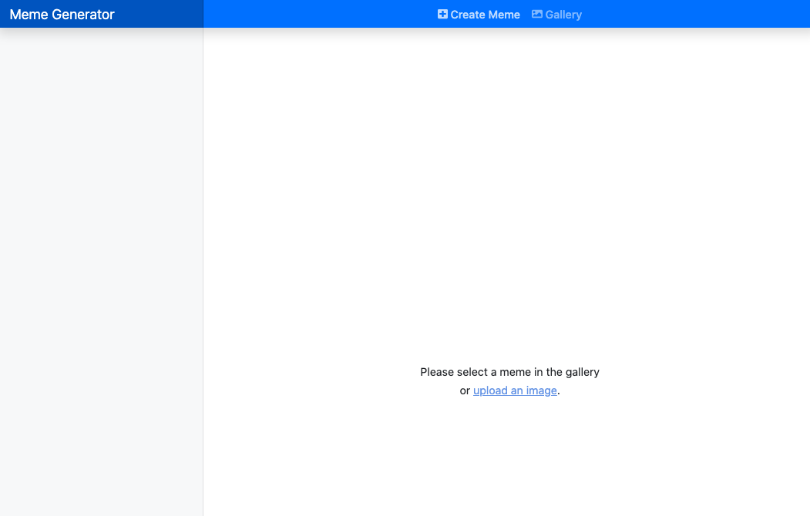
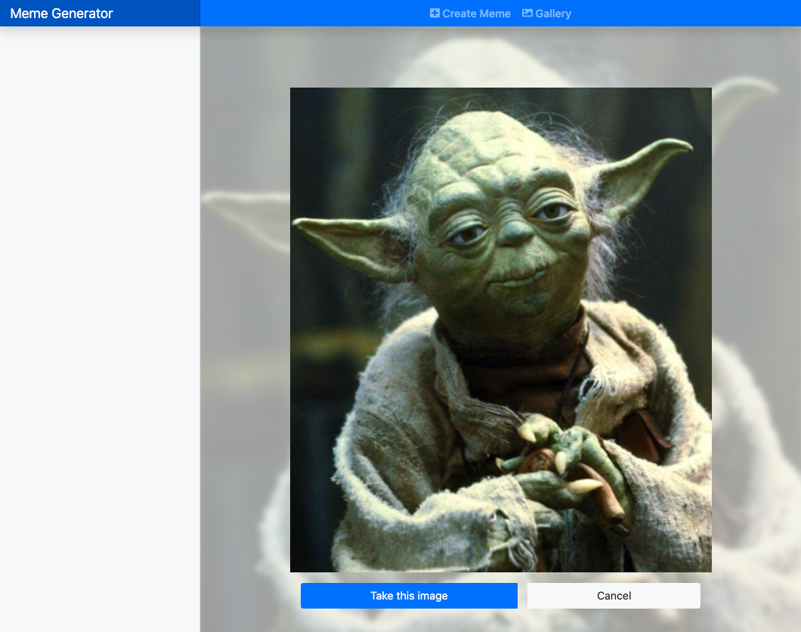
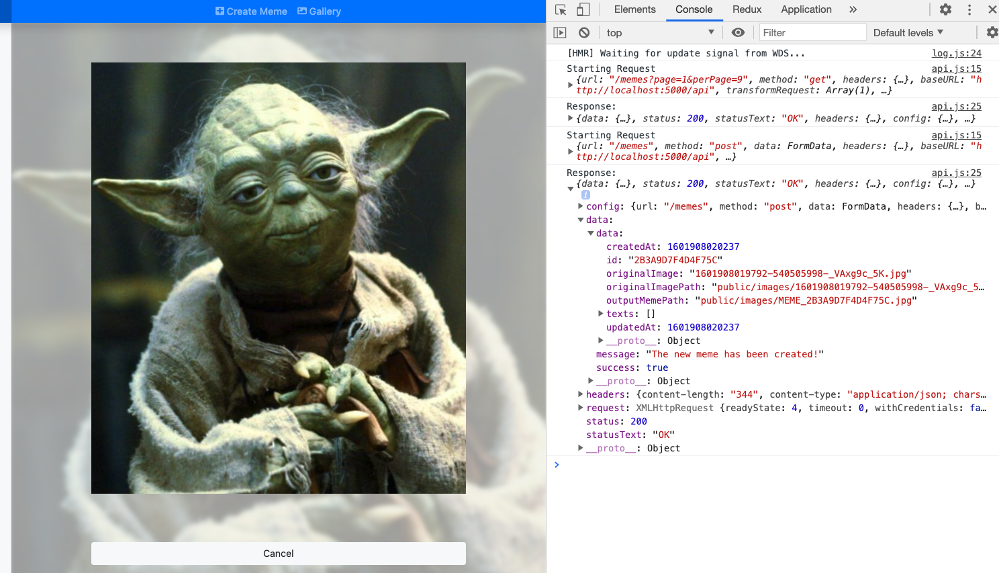

## User can create a new meme by uploading an image

### Show uploaded image and store in the global store

In this part, we will capture the uploaded image by the user, show it on the screen, and also store it in the global store. We provide a button so that user can decide to take the image as the meme's background. Then we will upload that image to the server and create a new meme.

- **Actions and reducer**
  - In `meme.constants.js`, add: 
  ```javascript
  export const CREATE_MEME_REQUEST = "MEME.CREATE_MEME_REQUEST";
  export const CREATE_MEME_SUCCESS = "MEME.CREATE_MEME_SUCCESS";
  export const CREATE_MEME_FAILURE = "MEME.CREATE_MEME_FAILURE";

  export const SET_SELECTED_MEME = "MEME.SET_SELECTED_MEME";
  ```

  - In `meme.actions.js`:
  ```javascript
  //...
  const createMemeRequest = (image) => async (dispatch) => {
    dispatch({ type: types.CREATE_MEME_REQUEST, payload: null });
    try {
      const formData = new FormData();
      formData.append("image", image);
      const res = await api.post(`/memes`, formData);
      dispatch({
        type: types.CREATE_MEME_SUCCESS,
        payload: res.data.data,
      });
    } catch (error) {
      console.log(error)
      dispatch({ type: types.CREATE_MEME_FAILURE, payload: error });
    }
  };

  const setSelectedMeme = (meme) => ({
    type: types.SET_SELECTED_MEME,
    payload: meme,
  });

  export const memeActions = {
    memesRequest,
    createMemeRequest,
    setSelectedMeme,
  };
  ```

  - In `meme.reducer.js`, add:
  ```javascript
  case types.CREATE_MEME_REQUEST:
      return { ...state, loading: true };
  case types.CREATE_MEME_SUCCESS:
    return {
      ...state,
      selectedMeme: {
        ...state.selectedMeme,
        ...payload,
        localImageUrl: `${process.env.REACT_APP_BACKEND_API}/${
          payload.outputMemePath.split("public/")[1]
        }?${payload.updatedAt}`,
      },
      loading: false,
    };
  case types.CREATE_MEME_FAILURE:
    return { ...state, loading: false };

  case types.SET_SELECTED_MEME:
    return { ...state, selectedMeme: payload };
  ```

- **Integrate with UI**
  - In `HomePage.js`:
  ```javascript
  import React, { useRef } from "react";
  import { Container, Button, ButtonGroup } from "react-bootstrap";
  import { useDispatch, useSelector } from "react-redux";
  import { memeActions } from "redux/actions";

  const HomePage = () => {
    const inputFile = useRef(null);
    const dispatch = useDispatch();
    const selectedMeme = useSelector((state) => state.meme.selectedMeme);
    const loading = useSelector((state) => state.meme.loading);

    const handleImportImage = async (fileList) => {
      const files = inputFile.current.files;
      const meme = {
        uploadedImage: files[0],
        localImageUrl: window.URL.createObjectURL(files[0]),
      };
      dispatch(memeActions.setSelectedMeme(meme));
    };

    const handleSubmitImage = () => {
      dispatch(memeActions.createMemeRequest(selectedMeme.uploadedImage));
    };

    const handleCancel = () => {
      dispatch(memeActions.setSelectedMeme(null));
    };

    return (
      <Container className="fill d-flex justify-content-center align-items-center">
        {selectedMeme && (
          <div
            className="content-overley"
            style={{ backgroundImage: `url(${selectedMeme.localImageUrl})` }}
          />
        )}
        {selectedMeme ? (
          <div className="main-meme">
            
            {selectedMeme.id ? (
              <div style={{ marginTop: "5em" }}>
                <Button
                  className="btn-block"
                  variant="light"
                  onClick={handleCancel}
                  disabled={loading}
                >
                  Cancel
                </Button>
              </div>
            ) : (
              <ButtonGroup className="d-flex m-3">
                {loading ? (
                  <Button
                    className="mr-3"
                    variant="primary"
                    type="button"
                    disabled
                  >
                    <span
                      className="spinner-border spinner-border-sm"
                      role="status"
                      aria-hidden="true"
                    ></span>
                    Submitting...
                  </Button>
                ) : (
                  <Button
                    className="mr-3"
                    onClick={handleSubmitImage}
                    variant="primary"
                  >
                    Take this image
                  </Button>
                )}
                <Button variant="light" onClick={handleCancel} disabled={loading}>
                  Cancel
                </Button>
              </ButtonGroup>
            )}
          </div>
        ) : (
          <p className="text-center">
            Please select a meme in the gallery <br />{" "}
            <label className="import-image-label" htmlFor="local-meme">
              <input
                type="file"
                ref={inputFile}
                className="import-image-label-input"
                onChange={() => handleImportImage()}
                accept="image/png, image/jpeg"
                id="local-meme"
              />
              or <span className="import-image-label-text">upload an image</span>.
            </label>
          </p>
        )}
      </Container>
    );
  };

  export default HomePage;
  ```
  - Add to `App.css`:
  ```css
  /*
  * Navbar
  */

  .navbar-brand {
    padding-top: .75rem;
    padding-bottom: .75rem;
    font-size: 1rem;
    background-color: rgba(0, 0, 0, .25);
    box-shadow: inset -1px 0 0 rgba(0, 0, 0, .25);
  }

  .navbar .navbar-toggler {
    top: .25rem;
    right: 1rem;
  }

  .navbar .form-control {
    padding: .75rem 1rem;
    border-width: 0;
    border-radius: 0;
  }

  .form-control-dark {
    color: #fff;
    background-color: rgba(255, 255, 255, .1);
    border-color: rgba(255, 255, 255, .1);
  }

  .form-control-dark:focus {
    border-color: transparent;
    box-shadow: 0 0 0 3px rgba(255, 255, 255, .25);
  }

  /*
  * Main Page
  */

  .fill { 
    min-height: 100%;
    height: 100%;
  }

  .import-image-label-input {
    visibility: hidden;
    width: 0;
    height: 0;
    cursor: default;
    opacity: 0;
  }
  .import-image-label-text {
    text-decoration: underline;
    color: rgb(112, 158, 232);
    cursor: pointer;
  }
  .mouse-hover:hover {
    opacity: 0.8;
    cursor: pointer;
  }
  .content-overley {
    background-repeat: no-repeat;
    background-size: cover;
    filter: opacity(0.4) brightness(88%) blur(4px);
    background-position: center center;
    position: absolute;
    left: -4px;
    top: -4px;
    bottom: -4px;
    right: -4px;
  }
  .main-meme{
    z-index: 999;
  }
  ```
### Evaluation

- You should see a "upload an image" link on the Home Page:
  
- Click on the link and choose an image, you should see:
  
- Click the button "Take this image", the app will upload the image to the server and create a "blank" meme:
  
- You may also notice that the selected image is resize too.

Good job! [Back to instructions](/README.md)