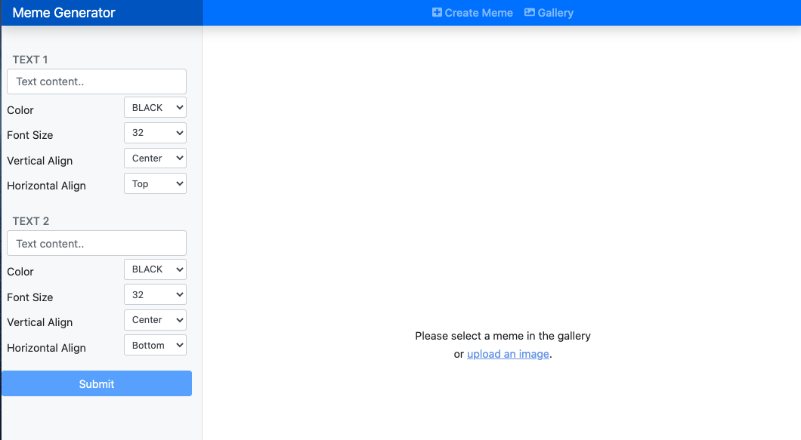
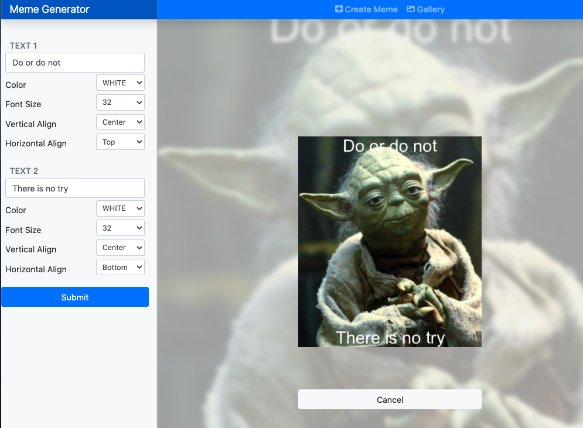

## User can add text to the image

In this task, we will add the side menu form. And when user submit the form, we will send a PUT Request to `api/memes/:memeId` to add the text on the image.

### The form on side menu

- In `SideMenu.js`:
  ```javascript
  import React, { useState, useEffect } from "react";
  import { Nav, Form, Row, Col, Button } from "react-bootstrap";
  import { useSelector, useDispatch } from "react-redux";
  import { memeActions } from "redux/actions";

  const ALIGNMENT_X = [
    { value: "HORIZONTAL_ALIGN_LEFT", view: "Left" },
    { value: "HORIZONTAL_ALIGN_CENTER", view: "Center" },
    { value: "HORIZONTAL_ALIGN_RIGHT", view: "Right" },
  ];
  const ALIGNMENT_Y = [
    { value: "VERTICAL_ALIGN_TOP", view: "Top" },
    { value: "VERTICAL_ALIGN_MIDDLE", view: "Middle" },
    { value: "VERTICAL_ALIGN_BOTTOM", view: "Bottom" },
  ];
  const COLORS = ["BLACK", "WHITE"];
  const FONT_SIZES = [8, 16, 32, 64, 128];

  const SideMenu = () => {
    const [texts, setTexts] = useState([
      {
        id: "text_top",
        content: "",
        color: "BLACK",
        size: 32,
        alignmentX: "HORIZONTAL_ALIGN_CENTER",
        alignmentY: "VERTICAL_ALIGN_TOP",
      },
      {
        id: "text_bottom",
        content: "",
        color: "BLACK",
        size: 32,
        alignmentX: "HORIZONTAL_ALIGN_CENTER",
        alignmentY: "VERTICAL_ALIGN_BOTTOM",
      },
    ]);
    const selectedMeme = useSelector((state) => state.meme.selectedMeme);
    const loading = useSelector((state) => state.meme.loading);
    const dispatch = useDispatch();

    const handleFormSubmit = (e) => {
      e.preventDefault();
      if (selectedMeme?.id) {
        dispatch(memeActions.updateMemeRequest(texts, selectedMeme.id));
      }
    };

    const handleEditInput = ({ textId, type, value }) => {
      const temp = JSON.parse(JSON.stringify(texts));
      temp.map((text) => {
        if (text.id === textId) {
          if (type in text) text[type] = value;
        }
        return text;
      });
      setTexts(temp);
    };

    useEffect(() => {
      if (selectedMeme?.id) {
        if (selectedMeme?.texts?.length) {
          setTexts((texts) => {
            return texts.map((text, index) => ({
              ...text,
              ...selectedMeme.texts[index],
            }));
          });
        }
      }
    }, [selectedMeme]);

    return (
      <Nav className="col-md-3 d-md-block bg-light sidebar collapse">
        <div className="sidebar-sticky pt-3">
          <Form onSubmit={handleFormSubmit}>
            {texts.map(
              ({ id, content, color, size, alignmentX, alignmentY }, index) => (
                <div key={id}>
                  <h6 className="sidebar-heading px-3 mt-4 mb-1 text-muted">
                    <span>TEXT {index + 1}</span>
                  </h6>
                  <Form.Group as={Row} className="px-2 mb-1">
                    <Col>
                      <Form.Control
                        type="text"
                        value={content}
                        onChange={(e) =>
                          handleEditInput({
                            textId: id,
                            type: "content",
                            value: e.target.value,
                          })
                        }
                        placeholder="Text content.."
                      />
                    </Col>
                  </Form.Group>
                  <Form.Group as={Row} className="px-2 mb-0">
                    <Form.Label column sm={7}>
                      Color
                    </Form.Label>
                    <Col sm={5}>
                      <Form.Control
                        size="sm"
                        value={color}
                        onChange={(e) =>
                          handleEditInput({
                            textId: id,
                            type: "color",
                            value: e.target.value,
                          })
                        }
                        as="select"
                      >
                        {COLORS.map((color) => (
                          <option value={color} key={color}>
                            {color}
                          </option>
                        ))}
                      </Form.Control>
                    </Col>
                  </Form.Group>
                  <Form.Group as={Row} className="px-2 mb-0">
                    <Form.Label column sm={7}>
                      Font Size
                    </Form.Label>
                    <Col sm={5}>
                      <Form.Control
                        size="sm"
                        value={size}
                        onChange={(e) =>
                          handleEditInput({
                            textId: id,
                            type: "size",
                            value: e.target.value,
                          })
                        }
                        as="select"
                      >
                        {FONT_SIZES.map((size) => (
                          <option value={size} key={size}>
                            {size}
                          </option>
                        ))}
                      </Form.Control>
                    </Col>
                  </Form.Group>
                  <Form.Group as={Row} className="px-2 mb-0">
                    <Form.Label column sm={7}>
                      Vertical Align
                    </Form.Label>
                    <Col sm={5}>
                      <Form.Control
                        size="sm"
                        as="select"
                        value={alignmentX}
                        onChange={(e) =>
                          handleEditInput({
                            textId: id,
                            type: "alignmentX",
                            value: e.target.value,
                          })
                        }
                      >
                        {ALIGNMENT_X.map((alignment) => (
                          <option value={alignment.value} key={alignment.value}>
                            {alignment.view}
                          </option>
                        ))}
                      </Form.Control>
                    </Col>
                  </Form.Group>
                  <Form.Group as={Row} className="px-2">
                    <Form.Label column sm={7}>
                      Horizontal Align
                    </Form.Label>
                    <Col sm={5}>
                      <Form.Control
                        size="sm"
                        as="select"
                        value={alignmentY}
                        onChange={(e) =>
                          handleEditInput({
                            textId: id,
                            type: "alignmentY",
                            value: e.target.value,
                          })
                        }
                      >
                        {ALIGNMENT_Y.map((alignment) => (
                          <option value={alignment.value} key={alignment.value}>
                            {alignment.view}
                          </option>
                        ))}
                      </Form.Control>
                    </Col>
                  </Form.Group>
                </div>
              )
            )}
            <Button
              className="btn-block"
              type="submit"
              variant="primary"
              disabled={!selectedMeme?.id || loading}
            >
              Submit
            </Button>
          </Form>
        </div>
      </Nav>
    );
  };

  export default SideMenu;
  ```

- Open the app, you should see the form to add text:
  

### Handle Form submit

- In `meme.constants.js`:
  ```javascript
  export const UPDATE_MEME_REQUEST = "MEME.UPDATE_MEME_REQUEST";
  export const UPDATE_MEME_SUCCESS = "MEME.UPDATE_MEME_SUCCESS";
  export const UPDATE_MEME_FAILURE = "MEME.UPDATE_MEME_FAILURE";
  ```
- In `meme.actions.js`:
  ```javascript
  const updateMemeRequest = (texts, memeId) => async (dispatch) => {
    dispatch({ type: types.UPDATE_MEME_REQUEST, payload: null });
    try {
      const body = { texts };
      const res = await api.put(`/memes/${memeId}`, body);
      dispatch({
        type: types.UPDATE_MEME_SUCCESS,
        payload: res.data.data,
      });
    } catch (error) {
      dispatch({ type: types.UPDATE_MEME_FAILURE, payload: error });
    }
  };

  export const memeActions = {
    memesRequest,
    createMemeRequest,
    setSelectedMeme,
    updateMemeRequest,
  };
  ```
  Remember to add `updateMemeRequest` in `export const memeActions = {...}`
- In `meme.reducer.js`, add
  ```diff
  case types.CREATE_MEME_REQUEST:
  +case types.UPDATE_MEME_REQUEST:
    return { ...state, loading: true };
  case types.CREATE_MEME_SUCCESS:
  +case types.UPDATE_MEME_SUCCESS:
    return {
      ...state,
      selectedMeme: {
        ...state.selectedMeme,
        ...payload,
        localImageUrl: `${process.env.REACT_APP_BACKEND_API}/${
          payload.outputMemePath.split("public/")[1]
        }?${payload.updatedAt}`,
      },
      loading: false,
    };
  case types.CREATE_MEME_FAILURE:
  +case types.UPDATE_MEME_FAILURE:
    return { ...state, loading: false };
  ```

### Evaluation

- Add text to the input box and submit
  
- Try with different option
- You should see the new meme in the gallery too

Good job! [Back to instructions](/client.md)
