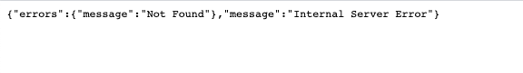

## Setup app.js

- Create `/helpers/utils.helper.js`:
  ```javascript
  "use strict";
  const utilsHelper = {};

  // This function controls the way we response to the client
  // If we need to change the way to response later on, we only need to handle it here
  utilsHelper.sendResponse = (res, status, success, data, errors, message) => {
    const response = {};
    if (success) response.success = success;
    if (data) response.data = data;
    if (errors) response.errors = errors;
    if (message) response.message = message;
    return res.status(status).json(response);
  };

  module.exports = utilsHelper;
  ```

- In `app.js`, add: 
  ```diff 
  +const utilsHelper = require("./helpers/utils.helper");

  const app = express();
  ```

- In `routes/`, delete `users.js`. In `app.js`,remove
  ```diff
  -const usersRouter = require("./routes/users");
  ...
  -app.use("/users", usersRouter);
  ```

- Create `routes/meme.api.js`:
  ```javascript
  const express = require("express");
  const router = express.Router();

  /**
  * @route GET api/memes
  * @description Get all memes
  * @access Public
  */
  router.get("/", function (req, res, next) {
    res.send({ status: "ok", data: "Get all memes" });
  });

  module.exports = router;
  ```

- In `routes/index.js`, replace everything with:
  ```javascript
  const express = require("express");
  const router = express.Router();

  // All route of Meme
  const memeAPI = require("./meme.api");
  router.use("/memes", memeAPI);

  module.exports = router;
  ```
  In `app.js`, change:
  ```diff
  -app.use("/", indexRouter);
  +app.use("/api", indexRouter);
  ```

- Import `cors`:
  ```diff
  const logger = require("morgan");
  +const cors = require("cors")
  ...
  app.use(cookieParser());
  +app.use(cors());
  ```

- Error Handling: In `app.js`, add
  ```javascript
  /* Initialize Routes */
  app.use("/api", indexRouter);

  // catch 404 and forard to error handler
  app.use((req, res, next) => {
    const err = new Error("Not Found");
    err.statusCode = 404;
    next(err);
  });

  /* Initialize Error Handling */
  app.use((err, req, res, next) => {
    console.log("ERROR", err);
    return utilsHelper.sendResponse(
      res,
      err.statusCode ? err.statusCode : 500,
      false,
      null,
      { message: err.message },
      "Internal Server Error"
    );
  });
  
  module.exports = app;
  ```

### Evaluation

- Open your browser and test `http://localhost:5000/api/memes`:
  
- And test `localhost:5000\whatever`:
  

Good job! [Back to instructions](/README.md)