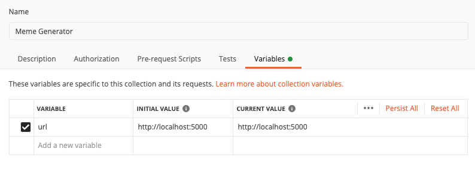
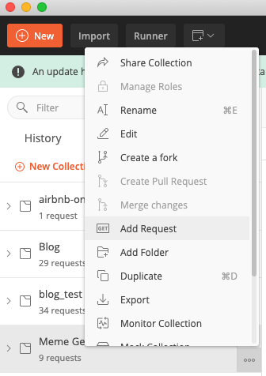
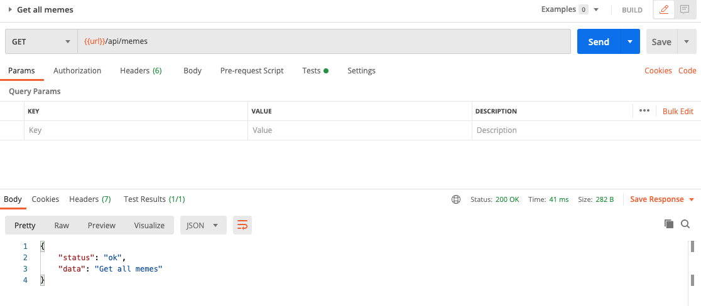
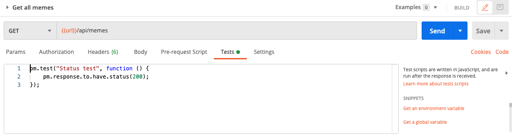
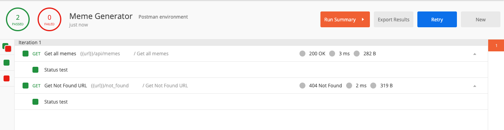

## Setup Postman

**Create a new collection**

- Open Postman, click `New Collection`
- Name: `Meme Generator`, Description (optional)
- Open tab `Variables` -> Variable: url, Initial Value: `http://localhost:5000`
- Click `Create`



**Create a new request**

- Hover the mouse on `Meme Generator` on the side menu, click `...` (View more actions)
- Click `Add Request` -> Name: "Get all memes" -> Save
  
- Click on the new Request -> `{{url}}/api/memes` -> Send -> Save
  
- Create another GET Request to test Not Found:
  - Name: Get Not Found URL
  - URL: `{{url}}/not_found`
- Later on you will have a bunch of requests like these. Let's quickly write some [test scripts](https://learning.postman.com/docs/writing-scripts/test-scripts/) so that we can test all URLs at once:
  - Click on `Get all memes` -> Open tab `Tests`:
  ```javascript
  pm.test("Status test", function () {
    pm.response.to.have.status(200);
  });
  ```
  - Click on `Get Not Found URL` -> Open tab `Tests`:
  ```javascript
  pm.test("Status test", function () {
    pm.response.to.have.status(404);
  });
  ```
  
- Remember to save the requests

### Evaluation

- Hover the mouse on `Meme Generator` on the side menu, click the "Arrow" icon -> Click `Run` -> Click `Run Meme Generator`
- You should see that we pass all the `Status test`
  

Good job! [Back to instructions](/README.md)