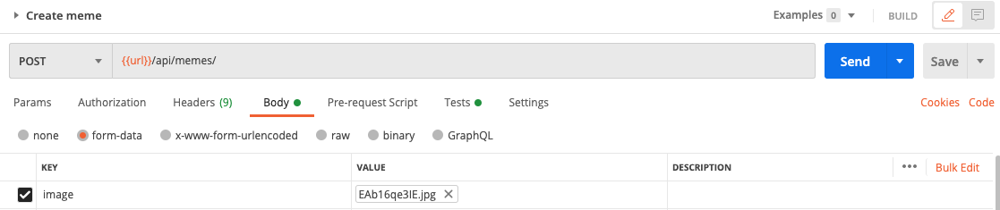

## User can upload an image

In this step we allow user to upload an image to the server. The server will save the image in the folder `public/images/.

- Create `/helpers/upload.helper.js`. This file will handle all things related to file upload, starting with the middleware to take a file from the user, and save it in our `public/images` folder. We need this file to make sure we keep the original filename, and to ensure (with reasonable confidence) that our filename will be unique, so we don't accidentally overwrite an old file. 

  ```javascript
  const multer = require("multer");

  const storage = multer.diskStorage({
    destination: "public/images",
    filename: function (req, file, cb) {
      cb(null, Date.now() + "-" + file.originalname);
    },
  });

  module.exports = {
    upload: multer({
      storage,
    }),
  };
  ```

- In `meme.api.js`:
  ```javascript
  //...
  const upload = require("../helpers/upload.helper").upload;
  //...
  /**
  * @route POST api/memes
  * @description Create a new meme
  * @access Public
  */
  router.post("/", upload.single("image"), (req, res, next) => {
    console.log(req.file);
    res.send({ status: "ok" });
  });
  ```

### Evaluation

- Open Postman, create a new POST Request to `{{url}}/api/memes` called `Create meme`. In the `body` tab, choose `form-data`. Now add a new field, with the key as `image` (this has to be the same as whatever is quoted in `upload.single("image")`. Choose the type as file (hover over the field, and you'll see a dropdown allowing you to choose either text or file), and select a file. Click `Send`.
  

- You should see the `ok` response and find the image in `public/images`. In the server console log, you should see the file object in `req` like this:
  ```
  {
    fieldname: 'image',
    originalname: 'EAb16qe3IE.jpg',
    encoding: '7bit',
    mimetype: 'image/jpeg',
    destination: 'path_to_your_project/public/images',
    filename: '1601882144635-695960738-EAb16qe3IE.jpg',
    path: 'path_to_your_project/public/images/1601882144635-695960738-EAb16qe3IE.jpg',
    size: 30894
  }
  POST /api/memes/ 200 2705.523 ms - 15
  ```

Good job! [Back to instructions](/README.md)
