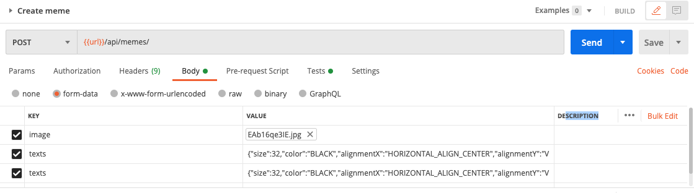
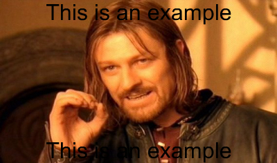

## Save meme data using controller

In this simple app, we use a `json` file to store the info of memes. This should be avoid in production app, and you should use a database to store the data.

- Create `/memes.json`:
  ```json
  {
    "memes":[]
  }
  ```

- We use a library called `crypto` to generate the id for the memes. In `utils.helper.js`, add:
  ```javascript
  const crypto = require("crypto");
  ...
  utilsHelper.generateRandomHexString = (len) => {
    return crypto
      .randomBytes(Math.ceil(len / 2))
      .toString("hex") // convert to hexadecimal format
      .slice(0, len)
      .toUpperCase(); // return required number of characters
  };
  ```

- Next we prepare a function to add the text on the image. In `photo.helper.js`, add:
  ```javascript
  photoHelper.putTextOnImage = async (
    originalImagePath,
    outputMemePath,
    texts
  ) => {
    try {
      const image = await Jimp.read(originalImagePath);
      const dimension = {
        width: image.bitmap.width,
        height: image.bitmap.height,
      };
      const promises = texts.map(async (text) => {
        const font = await Jimp.loadFont(
          Jimp[`FONT_SANS_${text.size}_${text.color}`]
        );
        await image.print(
          font,
          0,
          0,
          {
            text: text.content,
            alignmentX: Jimp[text.alignmentX],
            alignmentY: Jimp[text.alignmentY],
          },
          dimension.width,
          dimension.height
        );
      });
      await Promise.all(promises);
      await image.writeAsync(outputMemePath);
    } catch (err) {
      throw err;
    }
  };
  ```

- Create `controllers/meme.controller.js`:
  ```javascript
  const fs = require("fs");
  const utilsHelper = require("../helpers/utils.helper");
  const photoHelper = require("../helpers/photo.helper");

  const memeController = {};


  memeController.createMeme = async (req, res, next) => {
    try {
      // Read data from the json file
      let rawData = fs.readFileSync("memes.json");
      let memes = JSON.parse(rawData).memes;

      const meme = {};

      const texts = req.body.texts || []; 
      const textsArr = [].concat(texts); // Make sure texts is an array.
      meme.texts = textsArr.map((text) => JSON.parse(text));

      // Prepare data for the new meme
      meme.id = utilsHelper.generateRandomHexString(15);
      meme.originalImage = req.file.filename;
      meme.originalImagePath = req.file.path;
      const newFilename = `MEME_${meme.id}`;
      const newDirectory = req.file.destination;
      const newFilenameExtension = meme.originalImage.split(".").slice(-1);
      meme.outputMemePath = `${newDirectory}/${newFilename}.${newFilenameExtension}`


      // Put text on image
      await photoHelper.putTextOnImage(
        meme.originalImagePath,
        meme.outputMemePath,
        meme.texts
      );

      // Add the new meme to the beginning of the list and save to the json file
      meme.createdAt = Date.now();
      meme.updatedAt = Date.now();
      memes.unshift(meme);
      fs.writeFileSync("memes.json", JSON.stringify({ memes }));

      return utilsHelper.sendResponse(
        res,
        200,
        true,
        meme,
        null,
        "The new meme has been created!"
      );
    } catch (err) {
      next(err);
    }
  };


    module.exports = memeController;
  ```

- Then put the function `createMeme()` in `meme.api.js` to handle the POST request:
```javascript
//...
const memeController = require("../controllers/meme.controller");
//...
router.post(
  "/",
  uploader.single("image"),
  photoHelper.resize,
  memeController.createMeme
);
```

### Evaluation

- Test with Postman
  - POST request `Create meme`, add 2 `texts` to the body below `image`. An example of a text object:
  ```
  {"size":32,"color":"WHITE","alignmentX":"HORIZONTAL_ALIGN_CENTER","alignmentY":"VERTICAL_ALIGN_BOTTOM","content":"This is an example"}
  ```
  

- You should find the file `memes.json` is updated with the data of the new meme. You should also find a new image in `public/images/` that has a file name start with `MEME`, e.g. `MEME_A6C7D8B465F4E74.jpg`:
  

- Create POST request `Create meme without image`, expect response 500 "Image required"
- Create POST request `Create meme without texts`, expect response 200

Good job! [Back to instructions](/README.md)

