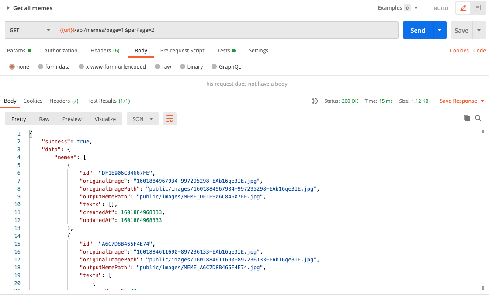

## User can get a list of memes with pagination

Now we have a bunch of test memes in the json file. Let's create an API to provide list of meme with pagination.

- Create the `getMemes()` in `meme.controller.js`:
  ```javascript
  memeController.getMemes = (req, res, next) => {
    const page = parseInt(req.query.page) || 1;
    const perPage = parseInt(req.query.perPage) || 10;

    console.log({page, perPage});
    res.status(200).json({ page, perPage });
  };
  ```

- In `meme.api.js`, change:
  ```diff
  /**
   * @route GET api/memes
   * @description Get all memes
   * @access Public
   */
  +router.get("/", memeController.getMemes);
  ```

- In Postman, change `Get all memes` URL to `{{url}}/api/memes?page=2&perPage=20`. Send it and check the server log, we expect to see page and perPage.

- Now let's write some code to return the according memes given `page` and `pageNum`. In `meme.controller.js`, add:
  ```javascript
  memeController.getMemes = (req, res, next) => {
    try {
      const page = parseInt(req.query.page) || 1;
      const perPage = parseInt(req.query.perPage) || 10;

      // Read data from the json file
      let rawData = fs.readFileSync("memes.json");
      let memes = JSON.parse(rawData).memes;

      // Calculate slicing
      const totalMemes = memes.length;
      const totalPages = Math.ceil(totalMemes / perPage);
      const offset = perPage * (page - 1);
      memes = memes.slice(offset, offset + perPage);

      return utilsHelper.sendResponse(
        res,
        200,
        true,
        { memes, totalPages },
        null,
        "Get memes successful"
      );
    } catch (err) {
      next(err);
    }
  };
  ```

### Evaluation

- Open Postman request `Get all memes`, play around with `page` and `pageNum` and check the result.

  

Good job! [Back to instructions](/README.md)