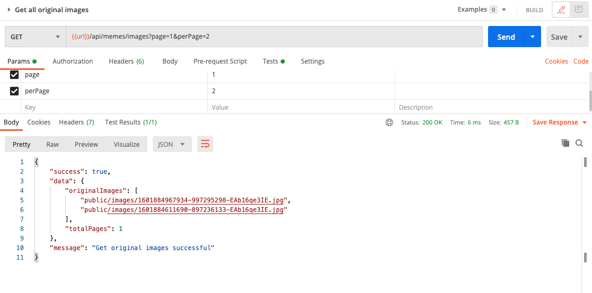

## User can see a list of original images

This feature allows user to create meme based on original images that are uploaded by the other users. 

- In `memeController.js`, add:
  ```javascript
  memeController.getOriginalImages = (req, res, next) => {
    try {
      const page = req.query.page || 1;
      const perPage = req.query.perPage || 10;

      // Read data from the json file
      let rawData = fs.readFileSync("memes.json");
      let memes = JSON.parse(rawData).memes;
      let originalImages = memes.map((item) => item.originalImagePath);
      originalImages = originalImages.filter(
        (item, i, arr) => arr.indexOf(item) === i
      );
      // Calculate slicing
      const totalMemes = memes.length;
      const totalPages = Math.ceil(totalMemes / perPage);
      const offset = perPage * (page - 1);
      originalImages = originalImages.slice(offset, offset + perPage);

      return utilsHelper.sendResponse(
        res,
        200,
        true,
        { originalImages, totalPages },
        null,
        "Get original images successful"
      );
    } catch (err) {
      next(err);
    }
  };
  ```

- In `meme.api.js`, add
  ```javascript
  /**
   * @route GET api/memes/images
   * @description Get list of original images
   * @access Public
   */
  router.get("/images", memeController.getOriginalImages);
  ```

### Evaluation

- Open Postman, create a new GET request to `{{url}}/api/memes/images?page=1&perPage=2` called `Get all original images` (very similar to `Get all memes`). Test the new API.
  

Good job! [Back to instructions](/README.md)