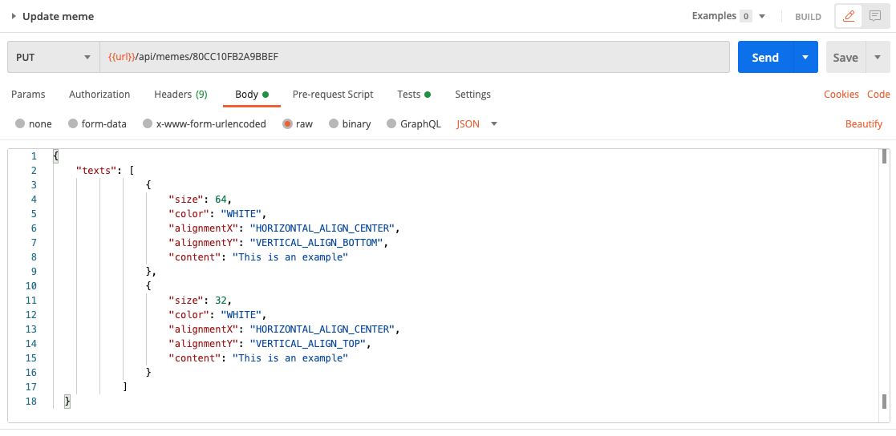

## User can edit the texts on the meme

In this feature, we allows user to edit the meme and change the content of the texts on it. So we will create a new API that handles PUT request to `api/memes/:id`. The idea is simple, we will take the original image and put the new texts on it. Basically we'll overwrite the old meme.

- In `memeController.js`, add:
  ```javascript
  memeController.updateMeme = async (req, res, next) => {
    try {
      const memeId = req.params.id;
      // Read data from the json file
      let rawData = fs.readFileSync("memes.json");
      let memes = JSON.parse(rawData).memes;
      const index = memes.findIndex((meme) => meme.id === memeId);
      
      if (index === -1) return next(new Error("Meme not found"));

      const meme = memes[index];
      let {texts} = req.body;
      meme.texts = texts && Array.isArray(texts) ? texts : [];
      meme.updatedAt = Date.now();

      // Put text on image
      await photoHelper.putTextOnImage(
        meme.originalImagePath,
        meme.outputMemePath,
        meme.texts
      );
      fs.writeFileSync("memes.json", JSON.stringify({ memes }));
      return utilsHelper.sendResponse(
        res,
        200,
        true,
        meme,
        null,
        "Meme has been updated!"
      );
    } catch (err) {
      next(err);
    }
  };
  ```

- In `meme.api.js`, add
  ```javascript
  /**
   * @route PUT api/memes/:id
   * @description Update text on the meme
   * @access Public
   */
  router.put('/:id', memeController.updateMeme)
  ```

### Evaluation

- Test with Postman: Pick one meme id in the json file, then
  - Create PUT request e.g. `{{url}}/api/memes/80CC10FB2A9BBEF`, add in `Headers` `Content-Type: application/json`. In `body`, choose `raw`:
  ```json
  {
    "texts": [
                {
                    "size": 64,
                    "color": "WHITE",
                    "alignmentX": "HORIZONTAL_ALIGN_CENTER",
                    "alignmentY": "VERTICAL_ALIGN_BOTTOM",
                    "content": "This is an example"
                },
                {
                    "size": 32,
                    "color": "WHITE",
                    "alignmentX": "HORIZONTAL_ALIGN_CENTER",
                    "alignmentY": "VERTICAL_ALIGN_TOP",
                    "content": "This is an example"
                }
            ]
  }
  ```
  
  - Test without `texts`
  - Test with wrong meme ID

Good job! [Back to instructions](/README.md)